## AI Engineer & Researcher - agents, inference, evals

I make models do cool stuff for you at scale :)

**100,000+** model downloads · **5.2M+** views of my technical writing · **1,000+** public GPU-template hours/month · Multi hackathon winner

### Research Highlights
- First author, *ExecRetrieval: Measuring the Functional-Correctness Gap in Code-Embedding Retrieval* - **EMNLP 2026 Main Conference**. Code retrieval that measures whether the code *runs*, not whether it looks right. Paper: [arXiv:2609.01865](https://arxiv.org/abs/2609.01865), [Dataset + harness](https://huggingface.co/datasets/AaryanK/ExecRetrieval)

### Agent systems Highlights
- **[Surface](https://github.com/Aaryan-Kapoor/Surface)** (private) - a universal display for AI agents. Your agent renders live UI onto any screen you own; every tap, stroke and answer lands back in its context, even hours after the session ended. One CLI + one skill, shared by every agent on the machine. `npm i -g surface-display`
- **[24hr-research-agent](https://github.com/Aaryan-Kapoor/24hr-research-agent)** - decomposes a question into 200+ tasks and compiles book-length, fully cited reports from 1,000+ sources
- **[SOTA-Coder](https://github.com/Aaryan-Kapoor/SOTA-coder)** - autonomous coding-agent harness built from scratch: event-driven runtime, WebSocket streaming, dynamic MCP tool loading, no agent-SDK dependencies
- **[video-production-skill](https://github.com/Aaryan-Kapoor/video-production-skill)**, **[d2l-cli](https://github.com/Aaryan-Kapoor/d2l-cli)** / **[degreeworks-cli](https://github.com/Aaryan-Kapoor/degreeworks-cli)**

### Inference & models
- **AK quant lines** - custom per-tensor bit allocations, benchmarked head-to-head on KL divergence with 95% bootstrap CIs:
  - **[Qwen3.5-9B](https://huggingface.co/AaryanK/Qwen3.5-9B-GGUF)**: **31 wins / 3 ties / 0 losses** across 34 comparisons vs Unsloth, bartowski, lmstudio, mradermacher, byteshape, AtomicChat - up to 49% lower KLD than Unsloth at the same size
  - **[Meta Muse-Glimmer-30B](https://huggingface.co/AaryanK/Muse-Glimmer-30B-GGUF)**: **26 wins / 6 ties / 0 losses** vs Meta's own, Unsloth and bartowski
- **Auto-Quant** (private) - my end-to-end quantize-test-release pipeline behind [huggingface.co/AaryanK](https://huggingface.co/AaryanK): Day-0 GGUFs for major launches, 100k+ downloads
- **TurboQuant** KV-cache quantization in llama.cpp - **4.4× smaller KV cache**, no throughput loss; ported to ik_llama.cpp by the community
- One of the first **toggleable-reasoning LLMs** (Feb 2025, [DOI](https://doi.org/10.57967/hf/5366)) - trained with GRPO on a single consumer GPU
- Also: upstream llama.cpp contributor (MiMo-V2-Flash, Kimi Linear)

> *Will work for GPUs* · *The Why: waiting for RSI so I can take a nap*

[Hugging Face](https://huggingface.co/AaryanK) • [LinkedIn](https://www.linkedin.com/in/theaaryankapoor/) • [OpenReview](https://openreview.net/profile?id=~Aaryan_Kapoor1) • [Email](mailto:aaryankapoor2006@gmail.com)
